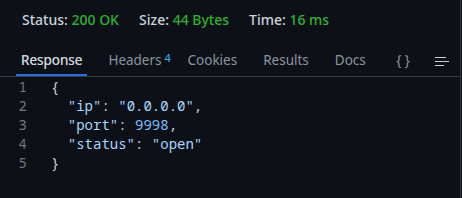
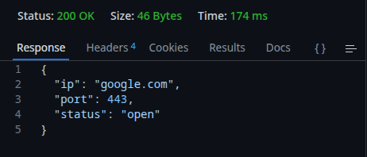
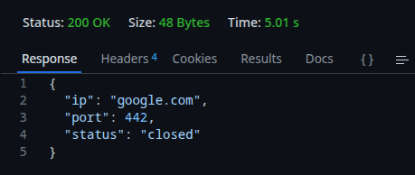
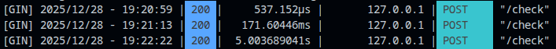
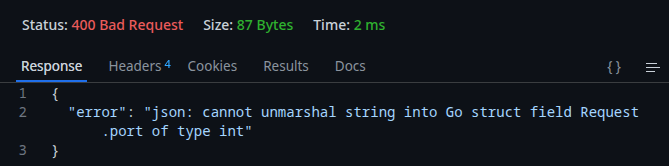

# TCP Port Checker

## Сборка и запуск

- `make run` - сбилдить и сразу запустить программу

- `make build` - файл сбилдится в директорию `./build/`

- `./build/tcp-port-checker -config ./configs/config.toml` - запуск с **параметром**

`-config` — путь к конфигурационному файлу (по умолчанию: `./configs/config.toml`)

---

### Требования
- Go 1.18+
- Make

## Демонстрация работы

### Проверка IP в локальной сети (порт открыт)

### Проверка внешнего IP

### Логи роутера в терминале

### Обработка неправильного запроса
Если пользователь отправляет некорректный запрос, то сервер возвращает ошибку с пояснением:

